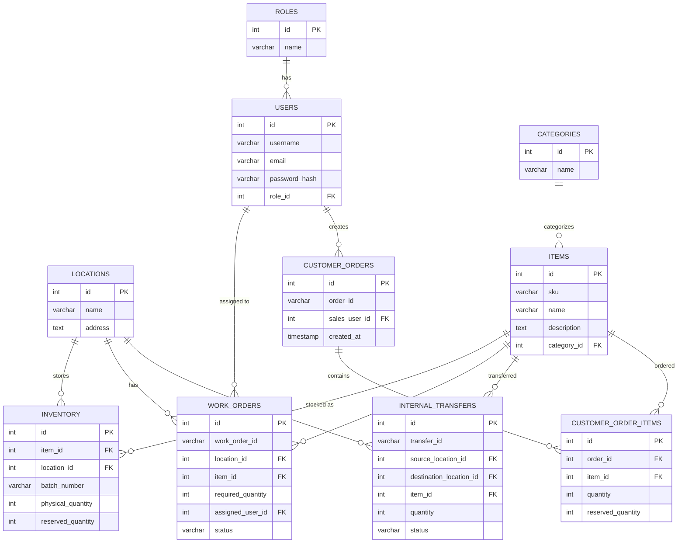

# Database Schema

This document outlines the PostgreSQL database schema for the Fundsroom-2 ERP application based on the actual implementation.

## Entity Relationship Diagram

## Tables & Relationships

### Users & Roles
- **roles**: Stores system roles (`ADMIN`, `OPERATIONS_USER`, `SALES_USER`).
- **users**: Stores user credentials and links to a specific role.

### Inventory Setup
- **locations**: Physical locations where items are stored.
- **categories**: Item classifications.
- **items**: Unique products defined by a SKU and tied to a category.
- **inventory**: Tracks the actual stock. A unique combination of `item_id`, `location_id`, and `batch_number`. Includes constraints to ensure `physical_quantity >= 0`, `reserved_quantity >= 0`, and `reserved_quantity <= physical_quantity`.

### Business Modules
- **work_orders**: Represents tasks requiring items at a location. Assigned to a user and has a status (`Assigned`, `In Progress`, `Completed`).
- **internal_transfers**: Tracks the movement of items between a `source_location_id` and a `destination_location_id`. Status moves from `Requested` to `Dispatched` to `Received`.
- **customer_orders**: Orders created by sales users.
- **customer_order_items**: The specific items and quantities requested in a customer order, along with how many have been successfully reserved.

## Database Integrity

Integrity is strictly enforced at the database level:
- **Foreign Keys**: Ensure no orphaned records exist.
- **Check Constraints**: Prevent invalid states directly in PostgreSQL (e.g., negative inventory, invalid status strings).
- **Unique Constraints**: Prevent duplicate items, usernames, and overlapping inventory batches.
